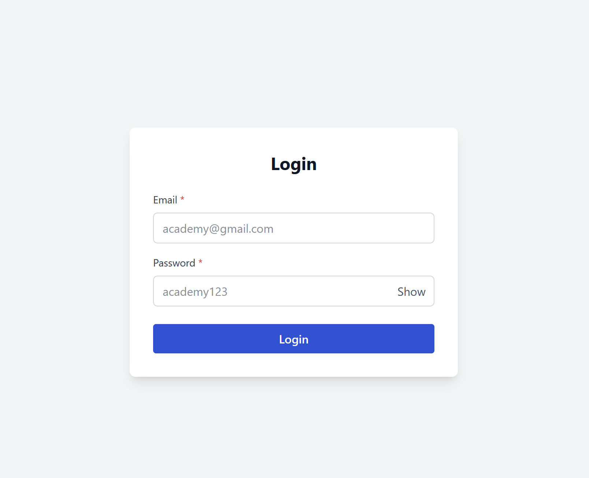
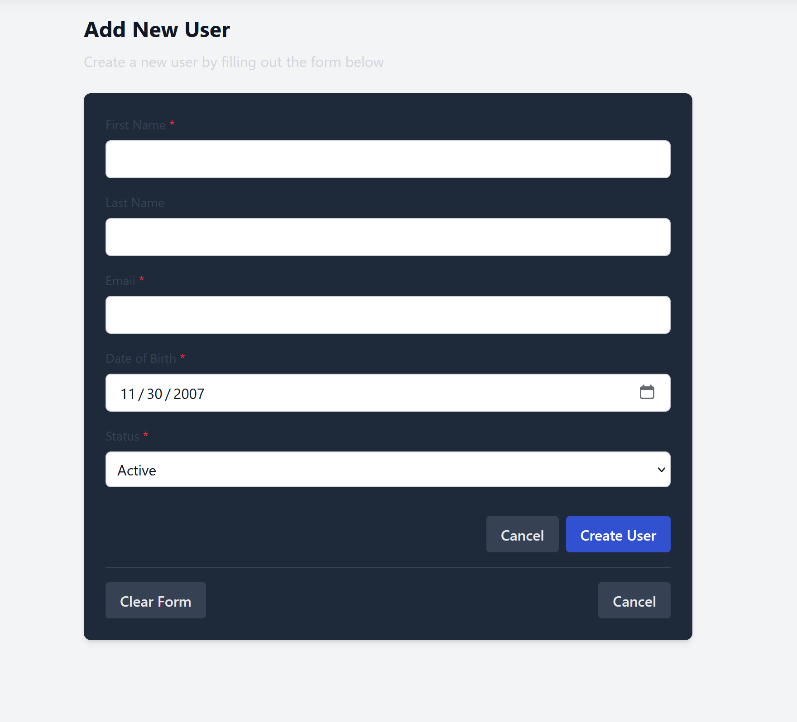
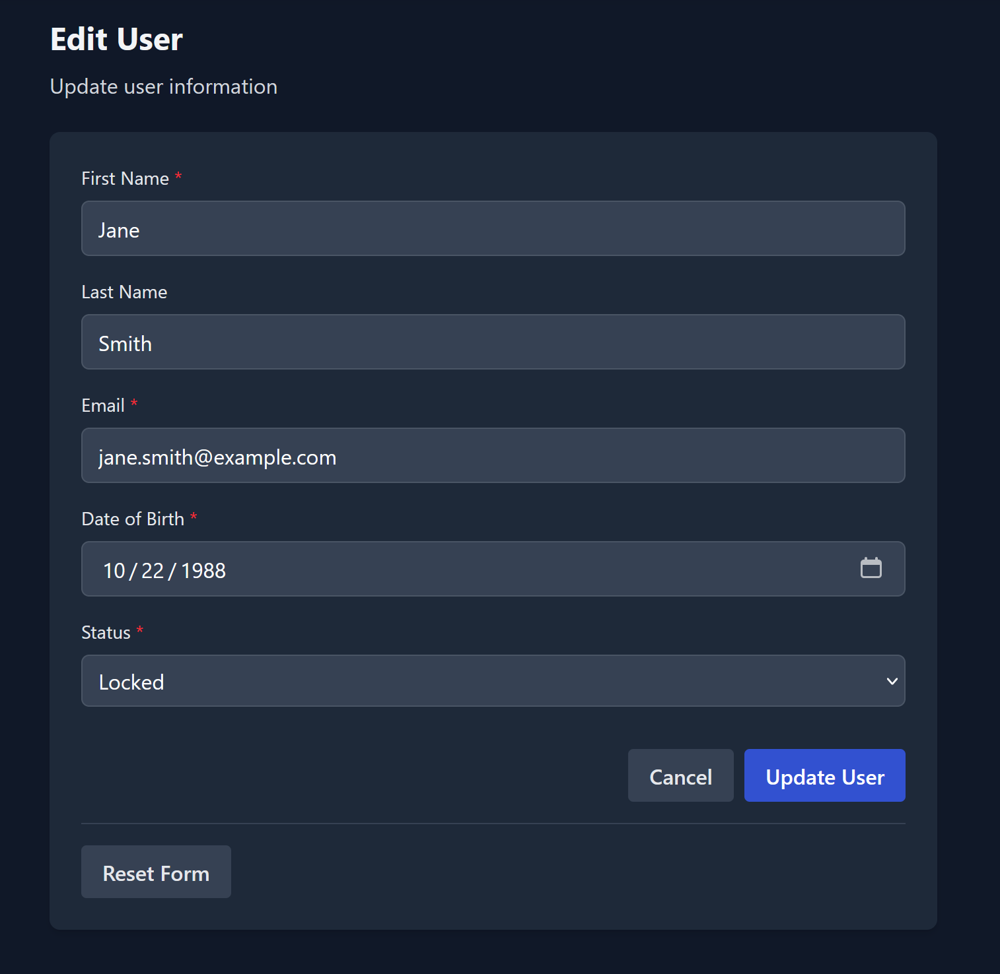
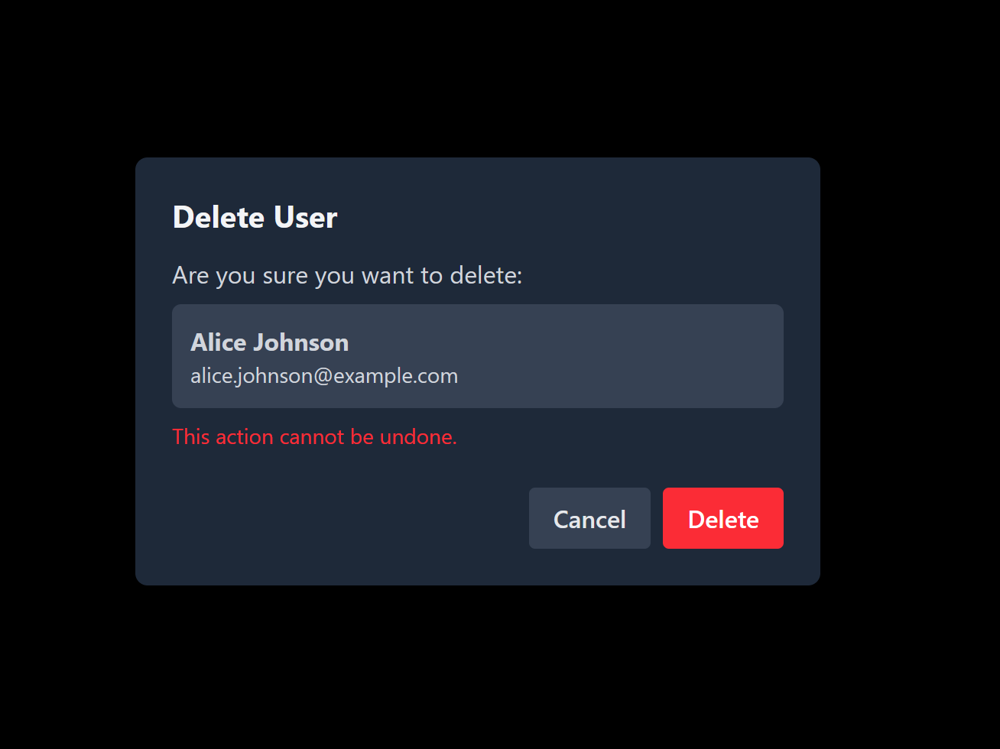
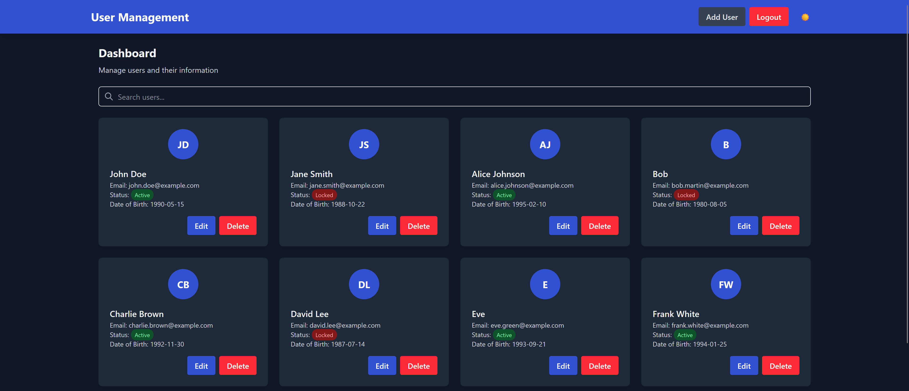

# Academy Assignment 4 – User Management App

This project is a **User Management Dashboard** built with **React + TypeScript**.  
It demonstrates authentication, protected routes, CRUD operations, React Query, Zustand state management, form validation with Zod, dark mode, optimistic updates, and a clean responsive UI.

The app uses a **mock API** (via Vite Plugin Mock) for local development.

---

## ✨ Key Features

---

### 🔐 Login & Protected Routes
- Users must log in to access the dashboard  
- Auth state stored using Zustand  
- JWT saved in localStorage  
- Auto-logout when token expires  
- Unauthenticated users are redirected to the login page  

---

### 🧑‍💼 Dashboard
- Displays a list of all users  
- Search by name  
- Prefetching user data on hover for faster navigation  
- Quick actions for Edit / Delete  

---

### ➕ Create User
- Form includes: first name, last name, email, date of birth, status  
- Validation using **React Hook Form + Zod**  
- Unsaved changes are saved as **drafts in localStorage**  
- Client-side validation & form reset  

---

### ✏️ Edit User
- Pre-filled form with existing data  
- **Optimistic updates** using React Query  
- Reset button restores original server data  
- Error-handling and retry logic  

---

### 🗑️ Delete User
- Confirmation modal before deletion  
- On success → Show toast notification  
- User list updates automatically  

---

### 🔍 Search & Prefetch
- Realtime filtering by name  
- Hovering over "Edit" prefetches data for fast transitions  

---

### 🌙 Dark Mode Toggle
- Global dark/light theme switch  
- Theme persisted in localStorage  

---

### 🗂️ State & Data Management
- **Zustand** → auth + theme state  
- **React Query** → caching, mutations, optimistic updates  
- Auto-handling of 401 errors (logs user out)  

---

### 🧪 Mock API & Error Handling
- Uses **vite-plugin-mock** for mock REST API  
- All API calls include auth headers  
- Automatic logout on unauthorized requests  

---

## 📸 Screenshots

> Add your real screenshots to: `/public/screenshots/`

### 🔐 Login


### 🧑‍💼 Dashboard – User List


### ➕ Add User


### ✏️ Edit User


### 🗑️ Delete Confirmation


### 🌙 Dark / Light Mode


---

## 🧰 Tech Stack

### Frontend
- React 19  
- TypeScript  
- React Router v7  

### Styling
- Tailwind CSS  

### Forms
- React Hook Form  
- Zod  

### State Management
- Zustand (auth + theme)

### Data Fetching
- @tanstack/react-query  

### Utilities
- date-fns  
- React Hot Toast  
- Vite Plugin Mock  

---

## 📂 Project Structure

```
Academy-Assignment-4/
├── src/
│   ├── api/              # API client functions & auth helpers
│   ├── components/       # UI components (atoms, molecules, organisms)
│   ├── hooks/            # React Query hooks (CRUD, prefetch)
│   ├── layouts/          # Dashboard & Auth layouts
│   ├── pages/            # Login, Dashboard, Add/Edit User
│   ├── router/           # Route definitions & protected routes
│   ├── schemas/          # Zod validation schemas
│   ├── store/            # Zustand stores (auth + theme)
│   ├── types/            # TypeScript interfaces
│   └── utils/            # Helpers (debounce, formatters, etc.)
├── mock/                 # Mock API (vite-plugin-mock)
├── public/
│   └── index.html
└── package.json          # Scripts & dependencies
```

---

## 🚀 Getting Started

### 1️⃣ Clone the repository
```bash
git clone https://github.com/mariok56/Academy-Assignment-4.git
cd Academy-Assignment-4
```

### 2️⃣ Install dependencies
```bash
npm install
```

### 3️⃣ Start the development server
```bash
npm run dev
```

Visit the app at:  
http://localhost:5173

The mock API automatically runs via **Vite Plugin Mock**.

### 4️⃣ Build for production
```bash
npm run build
```

The optimized app will be inside the **dist/** folder.

---

## 🔧 Environment Variables

This project does **not** require a real backend.  
The mock API is already configured in `vite.config.ts`.

If you later connect a real backend, create a `.env`:

```
VITE_API_URL=
```

And update API functions in `src/api/userApi.ts`.

---

## 🧑‍💻 Contributing

Contributions are welcome!

1. Create a descriptive branch name  
2. Follow the existing code style  
3. Add/update tests if needed  
4. Update README if your changes affect usage  
5. Submit a pull request  

---

## 📄 License

This project is for **educational purposes** as part of an academy assignment.  
Contact the repository owner for permissions beyond personal use.
